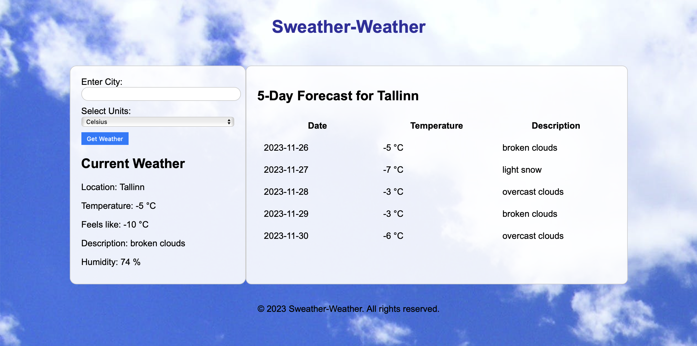
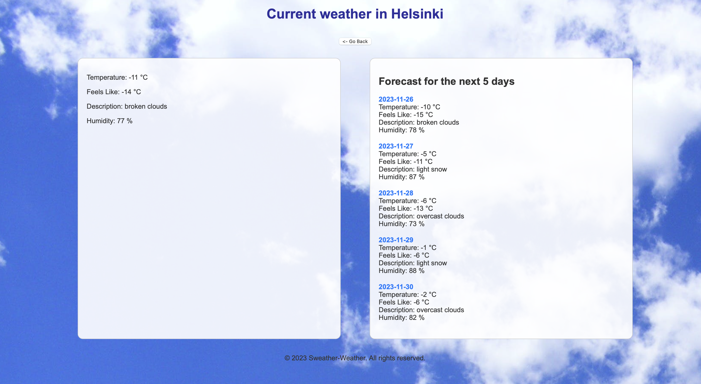

# sweater-weather
#  Django Weather Application

This weather application is built using Django, requests and openweathermap, 
here users can get weather information by default for the city Tallinn or entering the city name. 

### Framework

The current version of the template is based on:
- Python 3.11
- Django 4.2.6

### Database

- Currently, there are applied settings for Postgres server which is defined `settings.py`.
  The developer is free to configure the settings for any database technology that business needs require.

### Git

- The template already has `.gitignore` file which holds all the possible folders and cache files that should not be
  pushed to the GitLab.

### Installation

1. Clone the repository:
git clone https://github.com/ainarku/sweater-weather.git

2. Navigate to the project directory

3. Install the required dependencies:
pip install -r requirements.txt

4. Set up your OpenWeatherMap API key:

* Visit OpenWeatherMap (https://openweathermap.org/) to create an account.
* Obtain your API key from the dashboard.
* Create a file named .env in the project root and add your API key

### Configuration

1. Apply migrations:
python manage.py migrate

2. Start the development server:
python manage.py runserver

3. Open your web browser and navigate to http://127.0.0.1:8000/ to access the app.

### Usage
Enter the desired location in the search bar.
Click the "Get Weather" button to retrieve the current weather information.
You can use "Go back" button to start again and search a new location

### See the preview here:

